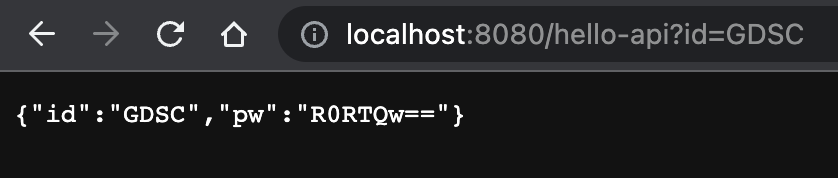

# GDSC 기초 백엔드 스터디

# 1주차

---

## MVC 패턴이란?

Model-View-Controller 이렇게 3가지 요소를 묶어 MVC라고 한다. MVC 패턴이란 소프트웨어 개발에서 이 3가지 요소를 활용한 설계 패턴을 의미한다.

1. **Model : 데이터와 비즈니스 로직을 의미**
2. **View : 유저 인터페이스를 의미**
3. **Controller : Model과 View 사이에서 중간다리 역할을 의미**

MVC패턴의 가장 큰 목표는, 역할의 분산에 있다. 서로 다른 요소가 서로에게 영향을 미칠 수 없도록 설계해서, 코드의 유지보수와 테스트하기 쉽게 만드는 것이 MVC 패턴의 가장 큰 목표이다.

## API와 서버?

Application Programming Interface의 약자. 서버와 클라이언트, 혹은 서버와 서버간의 통신하는 방법을 말한다.

객체를 반환하면 JsonConverter로 처리하여 우리가 주로 쓰는 JSON형태로 반환하고, 문자를 반환하면 StringConverter로 처리하여 string 형태로 반환한다.

Spring에서 API는 일반적으로 객체를 반환하는 것을 의미한다.

```java
package practice.Spring.controller;

import org.springframework.stereotype.Controller;
import org.springframework.ui.Model;
import org.springframework.web.bind.annotation.GetMapping;
import org.springframework.web.bind.annotation.RequestParam;
import org.springframework.web.bind.annotation.ResponseBody;
import java.util.Base64;
import java.util.HashMap;
import java.util.Map;

@Controller
public class HelloController {

    @GetMapping("hello-api")
    @ResponseBody
    public User helloApi(@RequestParam("id") String id) {
        User user = new User();
        user.setId(id);
        Map<String, String> userMap = new HashMap<>();
        userMap.put("id", user.getId());
        userMap.put("pw", user.getPw());
        return user;
    }

    static class User {
        private String id, pw;
        public String getId() {
            return id;
        }
        public String getPw() {
            return pw;
        }
        public void setId(String id) {
            this.id = id;
            this.pw = Base64.getEncoder().encodeToString(id.getBytes());
        }
    }
}
```

강사님이 보여주셨던 것과 비슷한 API를 만들어봤다.

Id를 입력받고, 그 아이디를 간단하게 Base64로 인코딩해서 pw에 저장하는 API이다.


*Get 방식으로 GDSC 입력했을 경우 이런식으로 작동된다.*

## RESTful 이란?

REST(Representative State Transfer)는 웹 서비스 구축을 위한 구조의 일종이다. 

REST란 

**1. HTTP URI 를 통해 자원(Resource)을 명시**하고, 

**2. HTTP Method(POST, GET, PUT, DELETE) 를 통해** 해당 자원에 대한 

**3. CRUD Operation(Create, Read, Update, Delete)을 적용**하는 구조를 지칭한다.

이 REST 구조는 일정한 특징을 가지고 있다.

- **인터페이스 일관성**: 일관적인 인터페이스로 분리되어야 한다.
- **클라이언트-서버 구조**: 클라이언트와 서버는 동일한 인터페이스로 분리된다.
- **상태 비저장 상호 작용**: 클라이언트에서 서버로 전송되는 각 요청에는 서버가 요청을 이해하는 데 필요한 모든 정보가 들어 있다. 서버는 요청 간에 클라이언트 컨텍스트를 저장하지 않는다.
- **캐시 가능성**: 서버의 응답은 클라이언트 또는 중간 캐시에 의해 캐시될 수 있다.
- **계층형 시스템**: 아키텍처는 각 계층(Layer)이 특정 기능을 수행하는 계층으로 구성된다.
- **주문형 코드(선택)**: 서버는 클라이언트에 실행 코드를 전송할 수 있으며, 이 코드는 클라이언트의 컨텍스트에서 실행될 수 있다.

이러한 특징을 가진 구조를 기반으로 만든 API를 REST API라고 하며, REST API의 설계 기본 규칙은 아래와 같다.

- URI는 자원의 정보를 표시해야 한다.
    - 동사보다는 명사를, 대문자보다는 소문자를 사용한다
    - 도큐먼트 이름으로는 단수 명사를 사용해야 한다
    - 컬렉션 이름으로는 복수 명사를 사용해야 한다
    - 스토어 이름으로는 복수 명사를 사용해야 한다
- 자원에 대한 행위는 HTTP Method(POST, GET, PUT, DELETE)로 표현한다.
    - URI에 HTTP Method 혹은 행위에 대한 동사 표현이 들어가면 안된다.
    - 경로 부분 중 변하는 부분은 유일한 값으로 대체한다.

이런 설계 구조를 바탕으로 REST API를 구현하여 웹 서비스를 제공하면, 그 웹 서비스를 Restful 하다고 표현한다.
